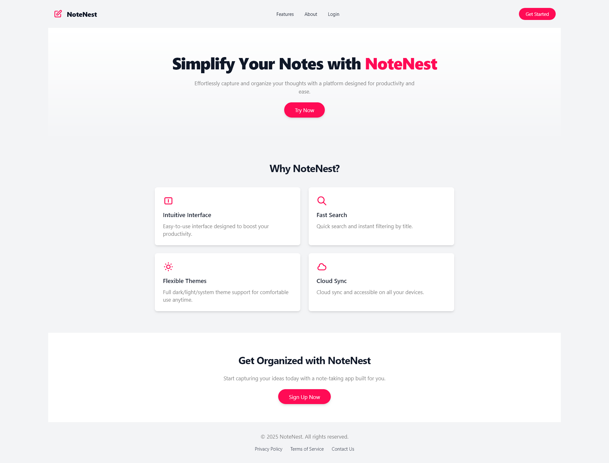
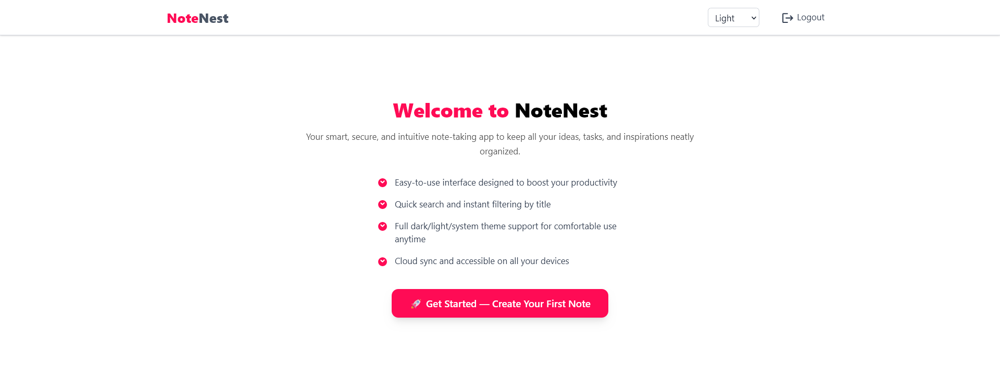
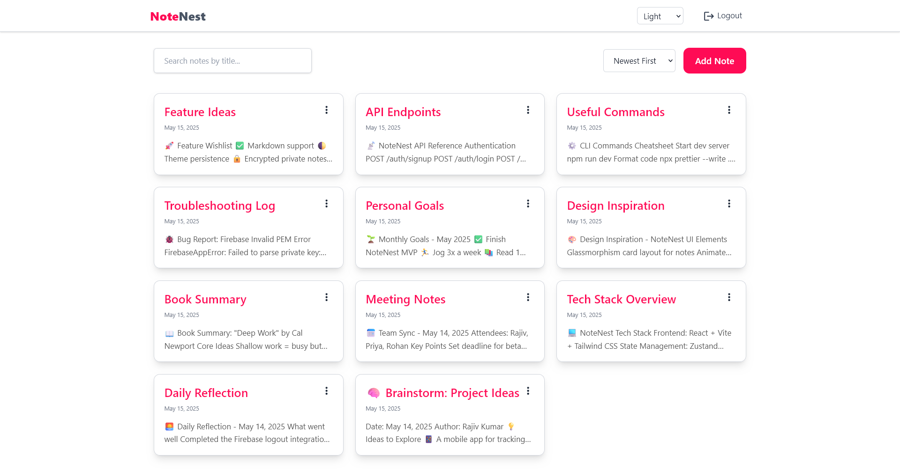
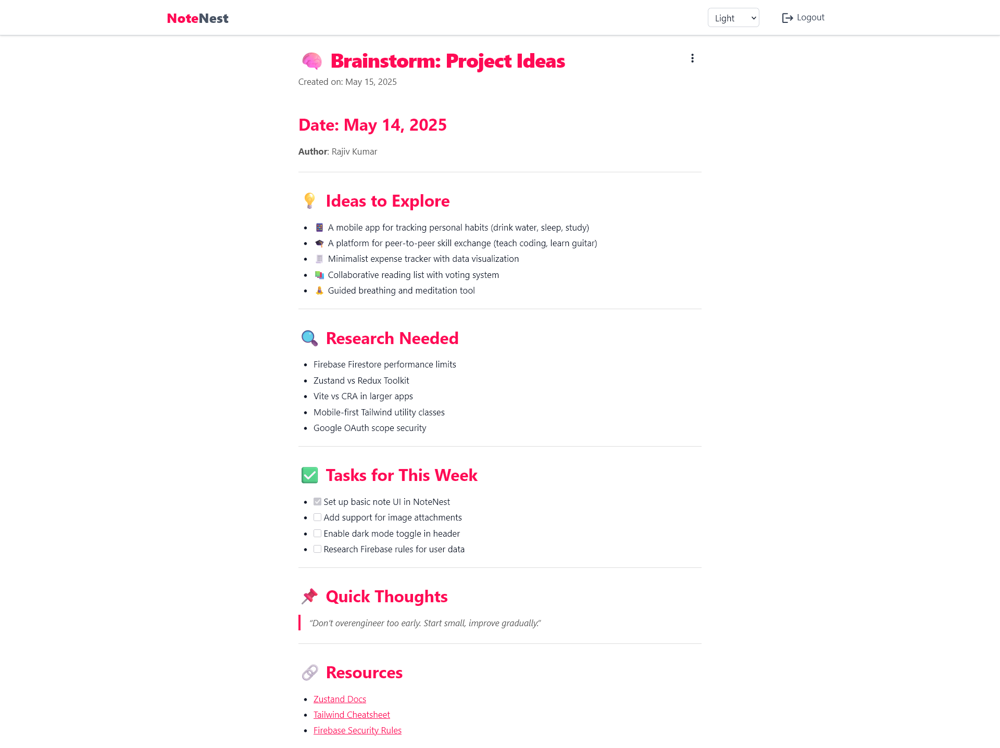
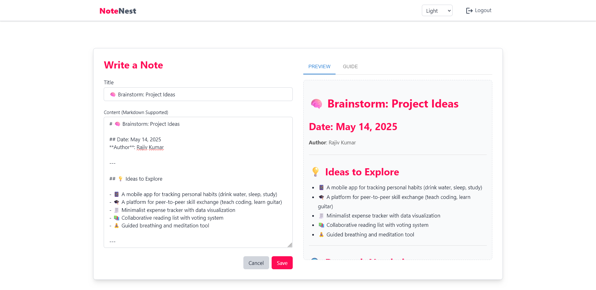

# [NoteNest](https://notenest-nzr0.onrender.com/)

NoteNest is a full-stack note-taking application that allows users to create, manage, and delete notes securely. Built with the MERN stack (MongoDB, Express, React, Node.js) and Firebase for authentication, NoteNest offers a clean, intuitive interface with key features like dark/light themes and a responsive design.

🔗 **Live Site**: [NoteNest](https://notenest-nzr0.onrender.com/)


## Features

-   **Google Authentication**: Secure sign-in using Firebase Authentication.
-   **CRUD Notes**: Create, read, update, and delete notes effortlessly.
-   **User-Specific Notes**: Securely store and manage notes specific to each user.
-   **Light/Dark Mode**: Toggle between light and dark themes for comfortable viewing.
-   **Responsive Design**: Utilizes Tailwind CSS for a seamless experience across devices.
-   **Toast Notifications**: Provides user feedback with toast notifications using Sonner.

## Tech Stack

-   **Frontend**:
    -   React
    -   Tailwind CSS
    -   Zustand
-   **Backend**:
    -   Node.js
    -   Express
-   **Database**:
    -   MongoDB
-   **Authentication**:
    -   Firebase Authentication

## Getting Started

Follow these instructions to get NoteNest up and running on your local machine.

### Prerequisites

-   Node.js and npm installed
-   MongoDB installed and running
-   Firebase project set up

### Running Locally

1.  **Clone the repository:**

    ```bash
    git clone <repository-url>
    cd note-app
    ```

2.  **Backend Setup:**

    ```bash
    cd backend
    npm install
    npm run dev
    ```

3.  **Frontend Setup:**

    ```bash
    cd ../frontend
    npm install
    npm run dev
    ```

4.  **Environment Variables:**

    Create `.env` files in both the `backend` and `frontend` directories.

    -   **Backend (.env):**

        ```
        MONGO_URI=<your_mongodb_connection_string>
        JWT_SECRET=<your_jwt_secret>
        PORT=5000
        FIREBASE_PROJECT_ID=<your_firebase_project_id>
        FIREBASE_CLIENT_EMAIL=<your_firebase_client_email>
        FIREBASE_PRIVATE_KEY=<your_firebase_private_key>
        ```

    -   **Frontend (.env.development):**

        ```
        VITE_API_URL=http://localhost:5000/api
        ```

    -   **Frontend (.env.production):**

        ```
        VITE_API_URL=/api
        ```

## Project Structure

### Backend

```
backend/
├── server.js # Main server entry point
├── config/
│ └── firebase.js # Firebase Admin SDK configuration
├── controllers/
│ ├── auth.controller.js # Authentication logic
│ └── notes.controller.js # Notes logic
├── lib/
│ ├── db.js # MongoDB connection
│ └── utils.js # Utility functions
├── middleware/
│ └── auth.middleware.js # Auth middleware
├── models/
│ ├── note.model.js # Note Mongoose schema
│ └── user.model.js # User Mongoose schema
├── routes/
│ ├── auth.route.js # Auth routes
│ └── notes.route.js # Notes routes
└── package.json # Backend dependencies
```

### Frontend

```
frontend/
├── src/
│ ├── components/ # Reusable React components
│ ├── pages/ # Page views (Login, Home, etc.)
│ ├── api/ # API interaction layer
│ ├── routes/ # Route definitions
│ ├── store/ # Zustand state management
│ ├── App.jsx # Root component
│ └── main.jsx # React app entry point
├── public/ # Static assets
├── index.html # HTML template
├── vite.config.js # Vite configuration
└── package.json # Frontend dependencies
```

## Screenshots

### 🏠 Homepage

*Homepage*

### 🔐 Login Page

*Login Page*

### 📝 Signup Page

*Signup Page*

### 📭 Empty Notes View


*When the user has not created any notes yet:*

### 📄 Notes List

*Notes List*

### 📑 Single Note View

*Single Note*

### ➕ Create New Note

*New Note*

## Deployment

NoteNest is hosted on [Github](https://github.com) for the frontend and [Render](https://render.com) for the backend.

## Credits

Made with ❤️ by [Rajiv](https://linkedin.com/in/rajiv0920)